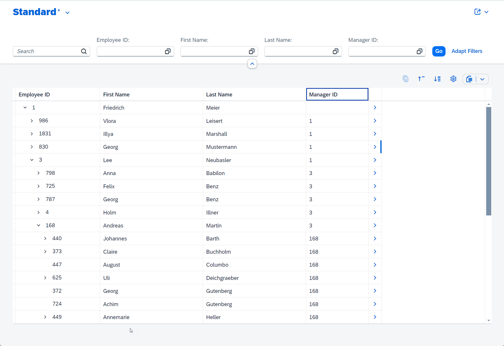

# AD180 - Build SAP Fiori Apps with ABAP Cloud powered by Joule's ABAP Developer capabilities

## Description

This repository contains the material for the SAP TechEd 2024 session called **AD180 - Build SAP Fiori Apps with ABAP Cloud powered by Joule's ABAP Developer capabilities**.

- [Requirements for attending this workshop](#requirements-for-attending-this-workshop)
- [Overview](#overview)
- [Exercises](#exercises)
- [Recording](#recording)
- [How to obtain support](#how-to-obtain-support) 
- [Further Information](#further-information)

## Overview
[^Top of page](#)

ABAP Cloud is the development model for building clean core compliant apps, services, and extensions on SAP S/4HANA Cloud, SAP S/4HANA, and SAP BTP ABAP Environment. ABAP Cloud covers different development scenarios such as transactional, analytical, intgeration, and enterprise search scenarios. The ABAP RESTful Application Programming Model (RAP) ist at the heart of ABAP Cloud for building transactional SAP Fiori apps, OData-based Web API, local APIs, and business events.

This session introduces attendees to the Joule's ABAP developer capabilities that support the fast development of transactional asa well as read-only SAP Fiori elements apps with ABAP Cloud. Attendees will learn how to display data in hierarchical treeview and how to define and raise business events with ABAP Cloud that can be consumed locally or remotely via SAP Event Mesh for loosely coupled integration scenarios. 

**SAP Fiori element-based app 01**  
In the first exercise block, you will learn how to build a transactional, draft-enabled SAP Fiori app with ABAP RAP powered by Joule's ABAP Developer capabilities, define and raise business events for loosely coupled scenarios. You will also learn to implement an event handler for the local consumption of the RAP business events.

  
Resulting app 01 > Click to expand!

    

  

**SAP Fiori element-based app 02**  
In the second exercise block, you will learn how to build a read-only SAP Fiori app with ABAP Cloud assisted Joule and display data in a hierachical tree view.

  
Resulting app 02 > Click to expand!

    

  

## Requirements for attending this workshop
[^Top of page](#)

The requirements to follow the exercises in this repository are the installation of the latest version of the ABAP Development Tools for Eclipse (ADT) installation 
on your laptop or PC and the access to a suitable ABAP system with a connection to the GenAI Hub, i.e. SAP BTP ABAP Environment with the connection to the [SAP AI Core](https://discovery-center.cloud.sap/serviceCatalog/sap-ai-core). The appropriate flavor of the [ABAP Flight Reference Scenario](https://github.com/SAP-samples/abap-platform-refscen-flight) (package `/DMO/FLIGHT`) must be imported into the relevant system. 

Before completing the exercises in this repository, you need to:
1. [Install the latest Eclipse platform and the latest ABAP Development Tools (ADT) plugin](https://developers.sap.com/tutorials/abap-install-adt.html)
2. [Create an user on the SAP BTP ABAP Environment Trial](https://developers.sap.com/tutorials/abap-environment-trial-onboarding.html) *
   > ℹ️ **Note**: For the the SAP TechEd Virtual 2024, the _SAP BTP ABAP Environment_ trial will be connected to the SAP AI Core from the 8th to the 11th October.
3. [Create an ABAP Cloud Project](https://developers.sap.com/tutorials/abap-environment-create-abap-cloud-project.html)
4. Adapt the Web Browser settings in your ADT installation:   
    i) Choose _Window_ > _Preferences_ in the menu bar.   
    ii) Navigate to _General_ > _Web Browser_.  
    iii) Activate the radio button _Use external web browser_.   
    iv) Select one of the listed external web browsers that are available, e.g. _Default system web browser_.    
        ❗Make sure that _Internet Explorer_ is not selected.   

<!--   
## Overview
[^Top of page](#)

 🔗[Access the presentation](url)
-->

## Exercises
[^Top of page](#)

### 🛠Exercise Block A: Building Transactional, Draft-enabled SAP Fiori Apps with Business Events

Learn how to build a transactional, draft-enabled SAP Fiori app with the ABAP RESTful Application Programming Model (RAP) powered by Joule's ABAP Developer capabilities, define and raise business events for loosely coupled scenarios.

  
Resulting app 01 > Click to expand!

    

  

| Exercise Block A | -- |
| ------------- |  -- |
| [Getting Started](exercises/ex0/README.md) | -- |
| [Exercise 1: Generate a transactional OData UI Service E2E with Joule's ABAP Developer capabilities](exercises/ex01/README.md) | -- |
| [Exercise 2: Enhance the RAP BO behavior with a business event](exercises/ex02/README.md) | -- |
| [Exercise 3: Play around with the AI-based ADT Wizard](exercises/ex03/README.md) | -- |

### 🛠Exercise Block B: Displaying hierachical data in SAP Fiori UI using read-only treeview

Learn how to build a read-only SAP Fiori app with the ABAP RESTful Application Programming Model (RAP) assisted by generative AI and display hierachical data in a read-only treeview.

  
Resulting app 02 > Click to expand!

    

  

> ℹ️ **Note**: This is a standalone exercise that can be carried out independently of the previous exercise block (A).   
> In case you start with this block then please begin with [Getting Started](exercises/ex0/README.md). 

| Exercise Block B | -- |
| ------------- |  -- |
| [Exercise 4: Generate a read-only OData UI service with Joule's ABAP Developer capabilities](exercises/ex04/README.md) | -- |
| [Exercise 5: Implement the read-only treeview for hierachical data display](exercises/ex05/README.md) | -- |

<!--
### 🛠 Optional Exercise: Create and deploy a SAP Fiori elements app with SAP BAS

Create a productive SAP Fiori elements List Report app with the SAP Business Application Studio (SAP BAS) on top of an OData service built with the ABAP RESTful Application Programming Model (RAP) and deploy it into the SAP BTP ABAP Environment system. 

> ℹ️ **Note**: This exercise can be completed immediately after Exercise Block A and Exercise Block B, which are independent exercises blocks.

| Exercise | -- |
| ------------- |  -- |
| [Exercise 6: Create an SAP Fiori elements app with SAP Business Application Studio and deploy it to the SAP BTP ABAP Environment](https://developers.sap.com/tutorials/abap-environment-deploy-fiori-elements-ui.html) (_Tutorial in the SAP Developer Center_)| -- |

--> 

## Known Issues
[^Top of page](#)

No known Issue.

## Contributing
[^Top of page](#)

Please read the [CONTRIBUTING.md](./CONTRIBUTING.md) to understand the contribution guidelines.

## Code of Conduct
[^Top of page](#)

Please read the [SAP Open Source Code of Conduct](https://github.com/SAP-samples/.github/blob/main/CODE_OF_CONDUCT.md).

## How to obtain support
[^Top of page](#)

Support for the content in this repository is available during the actual time of the online session for which this content has been designed. Otherwise, you may request support via the [Issues](../../issues) tab.

## Further Information
[^Top of page](#)

 - [ABAP RESTful Application Programming Model (RAP)](https://community.sap.com/topics/abap/rap) | SAP Community page   
 - [Modernization with RAP](https://blogs.sap.com/2021/10/18/modernization-with-rap/) | SAP Blogs
 - [RAP100 Tutorials Mission on SAP Developers Center](https://developers.sap.com/mission.sap-fiori-abap-rap100.html) | SAP Tutorials
 - [Create an SAP Fiori elements app with SAP Business Application Studio and deploy it to the SAP BTP ABAP Environment](https://developers.sap.com/tutorials/abap-environment-deploy-fiori-elements-ui.html) | SAP Tutorials
 - 
## License
Copyright (c) 2024 SAP SE or an SAP affiliate company. All rights reserved. This project is licensed under the Apache Software License, version 2.0 except as noted otherwise in the [LICENSE](LICENSES/Apache-2.0.txt) file.
