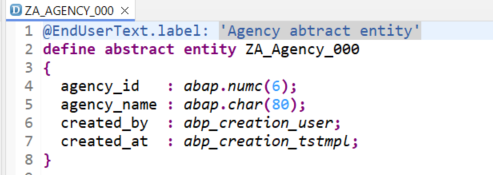
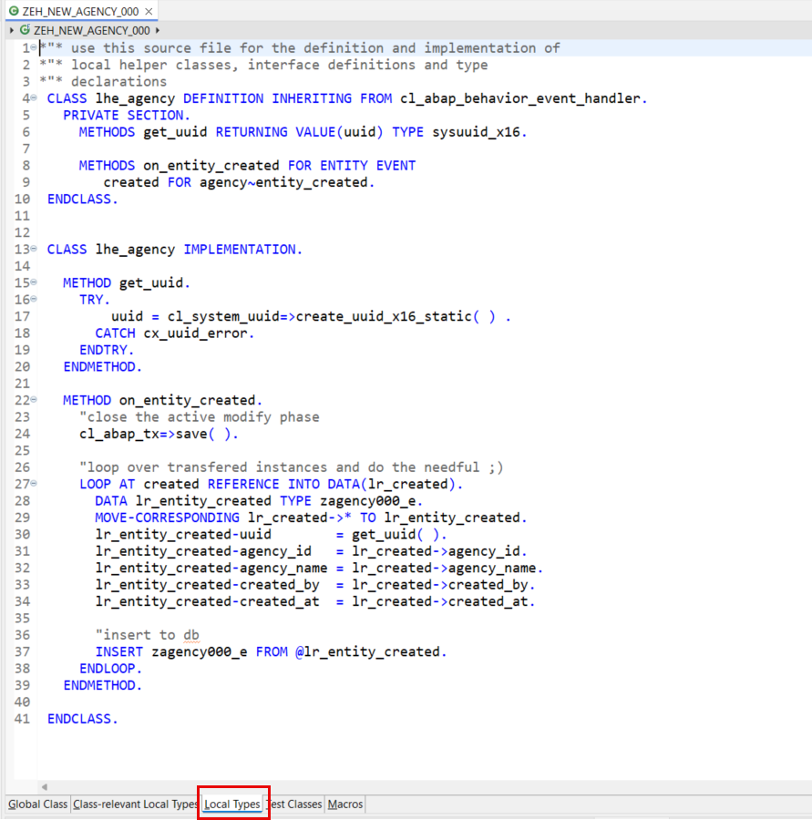
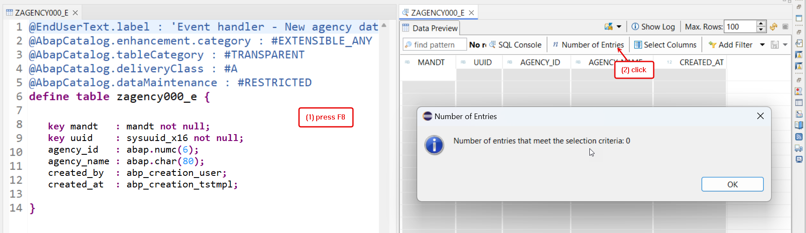

[Home - AD180](/README.md#exercises)

# Exercise 2: Enhance the RAP BO Behavior with a Business Event and Consume it locally

## Introduction
In the previous exercise, you've generated a UI service and the underlying RAP BO with the AI-based RAP BO generator (_Beta_) (see [Exercise 1](../ex01/README.md)).   

In this exercise, your RAP BO acts as an **event provider**. You will enhance the behavior definition of the _Agency_ BO entity **`ZR_Agency###`** with the business event  **`entity_created`**, which will be raised to send a message each time a new instance of the _Agency_ BO node is created to notify potential consumers.  

For the local event consumption, you will implement an event handler class that acts as an **event consumer**, listening to and processing events raised by your _Agency_ RAP BO in the same system.

### Exercises:
- [2.1 - Define the Business Event Parameter](#exercise-21-define-the-business-event-parameter )
- [2.2 - Define the Business Event in the _Agency_ BO](#exercise-22-define-the-business-event-in-the-agency-bo)
- [2.3 - Raise the Event in the _Agency_ BO](#exercise-23-raise-the-event-in-the-agency-bo)
- [2.4 - Create a Local Event Handler](#exercise-24-create-a-local-event-handler)
- [2.5 - Test the Enhanced App](#exercise-25-test-the-enhanced-app)
- [Summary & Next Exercise](#summary--next-exercise)  

> **Reminder:**   
> Don't forget to replace all occurences of the placeholder **`###`** with your choosen suffix or assigned group ID in the exercise steps below.  
> You can use the ADT function **Replace All** (**Ctrl+F**) for the purpose.   

### About Business Events in RAP

<details>
  <summary>ℹ️ Click to expand the details!</summary>
  
> Developers can now define and raise business events in a RAP BO or in a RAP BO behavior extension. 
> 
> RAP supports event-driven architecture natively on SAP BTP ABAP environment and SAP S/4HANA in the cloud and on-prem as of release 2022. Event-driven architecture enables asynchronous communication between an event provider and an event consumer in use cases where no direct response from the event consumer is required. 
> 
> Business events provide the opportunity of light-weight, decoupled process integration based on standardized and stable APIs and they are now a native part of the SAP - ABAP RESTful Application Programming Model. With the RAP Business Event Bindings Editor, you can create RAP Event Bindings which are needed to provide a mapping between the definition of RAP Events via behavior definition (BDEF) and the external representation of Business Events.
> 
> A RAP BO can act as event consumer or event provider.
>  
> RAP Business events can be consumed in other systems (_remote consumption_), or in the same system as they are raised (_local consumption_).  
  
> ℹ **Further reading**: [About RAP Business Events](https://help.sap.com/docs/btp/sap-abap-restful-application-programming-model/business-events) | [Develop RAP Business Events](https://help.sap.com/docs/abap-cloud/abap-rap/develop-business-events) | [Business Event Consumption](https://help.sap.com/docs/abap-cloud/abap-rap/business-event-consumption) |   
  
</details>

## Exercise 2.1: Define the Business Event Parameter
[^Top of page](#)

> Define an abstract entity that will later be used as parameter for defining the business event **`entity_created`**. The abstract entity define the interface for the data transfer to the event consumers.

 <details>
  <summary>🔵 Click to expand!</summary>

  1. Create a new CDS abstract entity.
  
     For that, go to the **Project Explorer**, navigate to the folder **Core Data Services** > **Data Definition** in your package, right-click on it, choose **New Data Definition** from the context menu, and maintain the required information provided below. 
       
      - Name: **`ZA_Agency_###`** (where `###` is your suffix)
      - Description: _**`Agency abtract entity`**_     
    
     Click **Next >**, and then finish.  
  
        
  
  3. Replace the default data definition with the source code provided below. Replace the placeholder **`###`** is your suffix.
        
        ```ABAP CDS
        @EndUserText.label: 'Agency abtract entity'
        define abstract entity ZA_Agency_###
        {
          agency_id   : abap.numc(6);
          agency_name : abap.char(80);
          created_by  : abp_creation_user;
          created_at  : abp_creation_tstmpl;            
        }  
        ```
  
        
    
  3. Save  (**Ctrl+S**) and activate  (**Ctrl+F3**) the new abstract entity.   
   
</details>


## Exercise 2.2: Define the Business Event in the _Agency_ BO
[^Top of page](#)

> Define the business event **`entity_created`** in the behavior definition of the _Agency_ BO.

 <details>
  <summary>🔵 Click to expand!</summary>

 1. Open the behavior definition of your _Agency_ BO **`ZR_Agency###`** in your package.
  
 2. Define the event **`entity_created`** using the keyword **`event`** in the behavior definition of the **_Agency_** BO node as shown on the screenshot below. The newly created abstract entity will be used as **`ZA_Agency_###`**.
  
    Insert the code snippet provided below for the purpose after the **`delete;`** statement. Replace the placeholder **`###`** with your suffix.

    ```ABAP
      //event(s)
      event entity_created parameter ZA_Agency_###;  
    ```  
  
 3. Business events must be raised in the save sequence at runtime, therefore, we have to enable the _additional save_ for our managed BO by specifying the statement **`with additional save`**. We will also add the keywords **`with full data`** to always have access to all the data of the relevant _Agency_ entity instances without having to read them.
  
    For that, insert the code snippet provided below after the `authorization master( global )` statement as shown on the screenshot below.

    ```ABAP
      with additional save with full data
    ```  
  
      
  
 4. Save  (**Ctrl+S**) and activate  (**Ctrl+F3**) the changes. 
 
    A **warning** now appears about the need for a redefinition of the local saver method **`save_modified`**. You will tackle this in the next step.

  4. Adjust the behavior implementation class (aka behavior pool) of the _Agency_ entity to reflect the enhancements of behavior definition. 
  
     > Hint: The logic for raising business event must be implemented in the method **`save_modified`** of the local saver class.
     
     For that, set the cursor on the statement **`with additional save with full data``** and press **Ctrl+1** to start the ADT Quick Fix.

     Select **`Add required method save_modified in new local saver class`** in the _Quick Assist_ view to update the behavior pool accordingly.
    
       
     
     The adjusted local saver class of the behavior implementation class **`ZBP_R_AGENCY###`** is now opened in **Local Types** tab of the editor.

     > ⚠️**Note**: Please check the name of your behavior pool in the BO behavior definition, as it may be different. Don't forget that all artifacts of your application are AI-generated.
  
</details>


## Exercise 2.3: Raise the Event in the _Agency_ BO
[^Top of page](#)

> You will now implement the logic for raising the business event **`entity_created`** in the local saver class of the BO behavior implementation class, 
> aka behavior pool, **`ZBP_R_AGENCY###`**.
> 
> The event **`entity_created`** will be raised with the information specified in the abstract entity anytime a new _Agency_ instance is created. 

 <details>
  <summary>🔵 Click to expand!</summary>

  1. Raise the event **`entity_created`** whenever a new _Agency_ instance is created in the local saver class **`lsc_zr_agency###`** of the behavior implementation class located on the **Local Types** tab ().
  
     For that, replace the empty implementation of the method **`save_modified`** with the source code provided below and replace all occurences of the placeholder **`###`** with your suffix (**Ctrl+F**).
  
     ```ABAP
     METHOD save_modified.
       "send notification for new agency instances
       IF create IS NOT INITIAL.
         "raise event
         RAISE ENTITY EVENT zr_agency###~entity_created
          FROM VALUE #(
            FOR agency IN create-agency
              "transferred information
              ( %key        = agency-%key
                agency_id   = agency-agencyId
                agency_name = agency-agencyName
                created_by  = agency-LocalCreatedBy
                created_at  = agency-LocalCreatedAt
              )
            ).
       ENDIF.
     ENDMETHOD.  
     ```
  
         
  
  4. Save  (**Ctrl+S**) and activate  (**Ctrl+F3**) the changes. 
   
  You can now close the behavior implementation class and continue with the next step where you will create a simple handler class to consume raised events.
     
</details>


## Exercise 2.4: Create a Local Event Handler
[^Top of page](#)

> For the local consumption of the raised events directly on the same system, you will now create a simple event handler class which will log the received event data in a database table.

 <details>
  <summary>🔵 Click to expand!</summary>

  1. First, create a database table **`ZAGENCY###_E`** with a UUID-based primary key to store the received event information. 
     
     For that, go to your package **`ZRAP120_AGENCY_###`**, navigate to the folder **Dictionary** > **Database Tables**, right-click on it, and select the entry **New Database Table** from the context menu to launch the creation wizard.
       
     Maintain the required information provided below and click **Next >**.  
  
      - Name: **`ZAGENCY###_E`**, where `###` is your suffix
      - Description: **`Event data for new agencies`**
  
     Select a transport request and click **Finish** to create the database table.
  
      

  3. Replace the default table definition with the source code provided below and replace all occurences of the placeholder **`###`** with your suffix. 
  
      <pre lang="ABAP">
      @EndUserText.label : 'Event handler - New agency data'
      @AbapCatalog.enhancement.category : #EXTENSIBLE_ANY
      @AbapCatalog.tableCategory : #TRANSPARENT
      @AbapCatalog.deliveryClass : #A
      @AbapCatalog.dataMaintenance : #RESTRICTED
      define table zagency###_e {

        key mandt   : mandt not null;
        key uuid    : sysuuid_x16 not null;
        agency_id   : abap.numc(6);
        agency_name : abap.char(80);
        created_by  : abp_creation_user;
        created_at  : abp_creation_tstmpl;
      }
      </pre>  
  
       

  3. Save  (**Ctrl+S**) and activate  (**Ctrl+F3**) the changes.
  
  4. Now go ahead, create and implement the event handler class **`ZEH_NEW_AGENCY_###`** for the local consumption of the event **`entity_created`** raised by the _Agency_ BO entity.
     
     For that, go to the **Project Explorer**, navigate to the folder **Source Code Library** > **Classes** in your package, right-click on it, and select the entry **New ABAP Classes** from the context menu to launch the creation wizard.
   
     Maintain the required information provided below and press **Finish**.
  
       - Name: **`ZEH_NEW_AGENCY_###`**, where `###` is your suffix
       - Description: **`Event handler for new Agency instances`**  
     
     Select a transport request, and click **Finish** to create the ABAP class.
  
      
  
  5. Specify the class as event handler class pool for your RAP BO by adding the statement **`FOR EVENTS OF <entity_name>`** of the class definition section on the **Global Class** tab, directly after the keyword **`FINAL`** as shown on the screenshot. Replace the placeholder **`###`** with your suffix.
  
     <pre lang="ABAP">
          FOR EVENTS OF ZR_AGENCY###
     </pre>
   
       
  
     You can now go ahead with the event handler implementation.
 
  6. Now go to the **Local Types** tab () to define and implement the local event handler class **`lhe_agency`** for the _Agency_ BO entity. 
  
     For that, simply replace the skeleton code with the source code provided in the document below. You can access the ABAP Keyword documentation (**F1**) for more details on the classes `cl_abap_behavior_event_handler` and `cl_abap_tx` used in the implementation.
  
     Do not forget to replace all occurences of the placeholder **`###`** with your suffix (**Ctrl+F**). 
       
      <details>
      <summary>🟠📄 Click to expand the source code!</summary>

       ```ABAP
       *"* use this source file for the definition and implementation of
       *"* local helper classes, interface definitions and type
       *"* declarations
        CLASS lhe_agency DEFINITION INHERITING FROM cl_abap_behavior_event_handler.
          PRIVATE SECTION.
            METHODS get_uuid RETURNING VALUE(uuid) TYPE sysuuid_x16.

            METHODS on_entity_created FOR ENTITY EVENT
               created FOR agency~entity_created.
        ENDCLASS.

        
        CLASS lhe_agency IMPLEMENTATION.

          METHOD get_uuid.
            TRY.
                uuid = cl_system_uuid=>create_uuid_x16_static( ) .
              CATCH cx_uuid_error.
            ENDTRY.
          ENDMETHOD.

          METHOD on_entity_created.
            "close the active modify phase
            cl_abap_tx=>save( ).

            "loop over transfered instances and do the needful ;)
            LOOP AT created REFERENCE INTO DATA(lr_created).
              DATA lr_entity_created TYPE zagency###_e.
              MOVE-CORRESPONDING lr_created->* TO lr_entity_created.
              lr_entity_created-uuid        = get_uuid( ).
              lr_entity_created-agency_id   = lr_created->agency_id.
              lr_entity_created-agency_name = lr_created->agency_name.
              lr_entity_created-created_by  = lr_created->created_by.
              lr_entity_created-created_at  = lr_created->created_at.

              "insert to db
              INSERT zagency###_e FROM @lr_entity_created.
            ENDLOOP.
          ENDMETHOD.

        ENDCLASS.
       ```   
      </details>     
  

       
  
     > **Brief explanation of the local RAP event handler class `lhe_employee`**
     >  <details>
     >   <summary>ℹ️ Click to expand the details!</summary>
     >    
     >   1. A local event handler class must inherit from the superclass **`cl_abap_behavior_event_handler`**.        
     >    
     >   2. Our current local event handler contains a RAP event handler method to handle **`on_entity_created()`** for the event **`entity_created`**.        
     >       - In the method signature, the importing parameter, the entity, as well as the event to be consumed are specified.
     >    
     >      > **Note**: An event can only be handled by one method within an event handler class. However, method handling across multiple handler classes is possible.
     >    
     >   3. In this exercise, the method **`get_uuid()`** is used for convenience to centrally generate UUIDs for the new database records to be persisted.
     >    
     >   4. About the implementation of the RAP event handler method: **`on_entity_created()`**: 
     >      - Because we are doing an insert on a database, we must first close the active modify phase of the RAP LUW by calling the method `cl_abap_tx=>save()`. 
     >      - Loop over the transfered event instances and do the needful 🙂        
     >    
     >  </details>    
  
  7. Save  (**Ctrl+S**) and activate  (**Ctrl+F3**) the changes.
          
</details>


## Exercise 2.5: Test the Enhanced App
[^Top of page](#)

> Check the result of your enhancements.

 <details>
  <summary>🔵 Click to expand!</summary>

 1. First, start the Data Preview (F8) of the new database table **`ZAGENCY###_E`** to store the received event information. No data should appear because no new _Agency_ has been created and therefore the event **`entity_created`** has not been raised yet.
  
         
  
 2. Now, go to your _Manage Agencies_ app, and, create a new _Agency_ record. 
    
      
   
      
  
 3. Go back to the ABAP Development Tools and refresh the Data Preview of the database table `ZAGENCY###_E` or start the Data Preview again (**F8**).  
  
    A new entry for the newly created _Agency_ record should now be stored in the database table.

          
  
 4. You can repeat the test: Play around in the _Manage Agencies_ app and check the new entries in the database table `ZAGENCY###_E`.
   
</details>


## Summary & Next Exercise
[^Top of page](#)

Now that you've... 
- defined a business event in the behavior definition,
- raised the event in the behavior implementation class,
- created a local event handler, and
- tested the enhanced Fiori elements-based _Managing Agencies_ App,

you can continue with ...
- the next exercise ► **[Exercise 3: Play Around with the GenAI-based ADT Wizard (Beta)](../ex03/README.md)**.
- or directly with the next exercise block (B) ► **[Exercise 4: Generate a read-only OData UI Service with GenAI](../ex04/README.md)**     

## License

Copyright (c) 2024 SAP SE or an SAP affiliate company. All rights reserved. This project is licensed under the Apache Software License, version 2.0 except as noted otherwise in the [LICENSE](LICENSES/Apache-2.0.txt) file.
