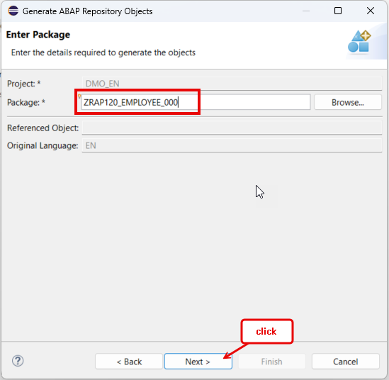

[Home - RAP120](/README.md#exercises)

# Exercise 4: Generate read-only OData UI Service E2E with GenAI and RAP

## Introduction

> ℹ️ **Note**: This exercise is independent from the previous exercise block (A), i.e. [exercises 1-3](../ex01/README.md). 

In this exercise group (B), you will create a read-only OData UI service along with the underlying RAP business object to manage agencies using the GenAI-based ABAP repository object generator (_Beta_) provided in the ABAP Development Tools for Eclipse (ADT). 

In the present exercise, you will create an ABAP package, generate all development artefacts using the GenAI-based ADT wizard and a predefined promt with a natural description of the application, and then create am ABAP class to populate demo agency data in the generated database table. The generation will create the required database table, the CDS data model, the service definition, and the service binding. 

At the end, you will publish and preview your _Employee_ app using the _Fiori Elements App Preview_ function provided in ADT. 

### Exercise Steps

- [Exercise 4.1 - Create an ABAP Package](#exercise-41-create-an-abap-package)
- [Exercise 4.2 - Generate a read-only UI Service using GenAI](#exercise-42-generate-a-read-only-ui-service-using-genai)
- [Exercise 4.3 - Adjust the Generated UI Service](#exercise-43-adjust-the-generated-ui-service)
- [Exercise 4.4 - Populate Demo Data](#exercise-44-populate-demo-data)
- [Exercise 4.5 - Preview the _Employee_ App](#exercise-45-preview-the-employee-app)
- [Summary & Next Exercise](#summary--next-exercise)  


> ℹ️ **Reminder:**   
> Don't forget to replace all occurences of the placeholder **`###`** with your chosen suffix or Group ID in the exercise steps below.   
> You can use the ADT function **Replace All** (**Ctrl+F**) for the purpose.   
> If you haven't been assigned a Group ID, then select a combination of three (3) numbers and/or letters, such as e.g. `000` or `AI1`. 
> 
> ⚠️ Always remember in mind that the names of your development objects may differ from the names used in the exercise instructions, code snippets, and screenshots. 

## Exercise 4.1: Create an ABAP Package
[^Top of page](#)

> Create your exercise package **`ZEmployee_Hierarchy_RO_###`**.   
> This ABAP package will contain all the artefacts you will be creating in the different exercises of this hands-on session.

 <details>
  <summary>🔵 Click to expand!</summary>

   1. In ADT, go to the **Project Explorer**, right-click on your ABAP Cloud Project, select **New** > **ABAP Package** from the context menu.
 
      Maintain the required information provided below and click **Next** to continue. 
 
      Replace the occurrence of the placeholder **`###`** with your chosen or assigned suffix, which should be a combination of three (3) numbers and/or letters, e.g. **`476`** or **`AP3`**. 
 
      - Name: **`ZRAP120_Employee_###`** 
      - Description: _**`Employees App`**_
      - Select the box ✅**Add to favorites package**
      - Superpackage: **`ZLOCAL`**  
 
      > ℹ️ The suffix **`000`** is used for the screenshots in this exercise. Use a different suffix.        
 
      Provide a transport request if requested and click **Finish**.           
      
      

</details>

## Exercise 4.2: Generate a read-only UI Service using GenAI
[^Top of page](#)

 > Generate an OData-based UI service using the AI-based generator from the **_Generate ABAP Repository Objects_** wizard provided in ADT.

 <details>
  <summary>🔵 Click to expand!</summary>

   1. Right-click on your ABAP Cloud project and select **New** > **Generate ABAP Repository Objects** from the context menu.
      
      Select the entry **`OData UI Service Supported by AI (Beta)`** in the wizard and click **Next >**.
      
      Maintain your package name **`ZRAP120_Employee_###`** and click **Next >**.                  
 
      <table>
      <tr>
          <td></td>
          <td></td>
          <td></td>
      </tr>
      </table>

   3. Clear the default prompt, insert the one provided below for this exercise, and click **Next >**. 
 
      Replace the occurence of the placeholder `###` with your chosen suffix.
      
 
      ```PROMPT
        Generate a read-only application for displaying employees. 
        The employee entity requires the fields employee_id, first_name, last_name, salary, manager_id, and manager_uuid. 
        Use a numerical data type with length 6 for the fields employee_id and manager_id.
        Use the uuid data type for the field manager_uuid.
        Use built-in character string data type char with length 40 for the fields first_name and last_name. 
        Salary is a currency field with length 21. 
        Create the object names with the suffix '###'.
      ```

      
 
       The wizard now shows the list of all artifacts that will be generated and the ability to preview some of them - e.g. database tables. 
        
       
 
      > ℹ️ **Note**:  
      > 
      > 1️⃣ Please note that the names of repository objects, table fields, and other elements in your preview may differ from those shown in the screenshots or used in the exercise description and the code snippets provided, as there is no guarantee from the GenAI side. The ability to customize the suggestions will be provided in future releases.
      >
      > 2️⃣ According to the [naming conventions of the Virtual Data Model (VDM) in SAP S/4HANA](https://help.sap.com/docs/SAP_S4HANA_CLOUD/c0c54048d35849128be8e872df5bea6d/8a8cee943ef944fe8936f4cc60ba9bc1.html), interface views have the prefix **`<namespace>I_`** and basic/composite restricted reuse views and BO views have the prefix **`<namespace>R_`**. 
      > The current wizard of the AI-based generator doesn't yet allow you to changes the generated artifact names. This option will be added in the future.        
      > For this reason, the generated interface view is a root view entity (instead of a simple view entity) and has the suffix `ZR_` instead of `ZI_` in this exercises.               

 
      > ℹ️ **Work-around**:   
      > In case you do not have access to the AI-based wizard, then create a database table using the table definition provided below and use the classic ADT wizard to create an UI service based on this database table.
 
      <details>
        <summary> 📄 Create a database table</summary>      
          First, create the database table **`ZEMPLOYEE###`** and replace the default code with thetable definition provided below. 
        
         Then right-click on it and select the entry **`Generate ABAP Repository Objects...`** from the context menu, and select **`OData UI Service`** in the dialog to start the classic generation.
              
         ```ABAP
           @EndUserText.label : 'Database Table for ZEMPLOYEE###'
           @AbapCatalog.enhancement.category : #NOT_EXTENSIBLE
           @AbapCatalog.tableCategory : #TRANSPARENT
           @AbapCatalog.deliveryClass : #A
           @AbapCatalog.dataMaintenance : #RESTRICTED
           define table zemployee### {

             key client   : abap.clnt not null;
             key uuid     : sysuuid_x16 not null;
             employee_id  : abap.numc(8);
             first_name   : abap.char(40);
             last_name    : abap.char(40);
             salary_curr  : abap.cuky;
             @Semantics.amount.currencyCode : 'zemployee###.salary_curr'
             salary       : abap.curr(21,2);
             manager_id   : abap.int8;
             manager_uuid : sysuuid_x16;
           }
         ```
       
         
       
      </details>
      
   5. Click **Next >**, select a transport request, and click **Finish** to start the generation of all artifacts. The generation of all artifacts may take a few moments.
        
      After the successfull generation, you can check all generated artifacts in the _**Project Explorer**_ view. You may need to refresh your package by pressing  pressing **F5**.  
 
      > **ℹ️ List of the generated repository objects**:
 
      <details>
        <summary>Click to expand!</summary>

        > **Note**: The names of the artifacts generated in your exercise package may differ from those listed in the table below 
        > as they are generated by GenAI and there is no guarantee from the GenAI side.

        | **Object Category**       | **Repository Object Type**  | **Artefact Names**                                                         |
        |---------------------------|-----------------------------|----------------------------------------------------------------------------|
        | **Business Services**     |                             |                                                                            |
        |                           | **Service Definitions**     | **`ZUI_EMPLOYEE###_O4`**                                                   |
        |                           | **Service Bindings**        | **`ZUI_EMPLOYEE###_O4`**                                                   |
        | **Core Data Services**    |                             |                                                                            |
        |                           | **Behavior Definitions**    | **`ZR_EMPLOYEE###`** - Base CDS view                                       |
        |                           |                             | **`ZC_EMPLOYEE###`** - Consumption view                                    |     
        |                           | **Metadata Definitions**    | **`ZC_EMPLOYEE###`** - Metadata extension for the consumption view         |
        | **Dictionary**            |                             |                                                                            |
        |                           | **Database Tables**         | **`ZEMPLOYEE###`** - Database table for storing active data                |
        
      </details>      
 
   7. Now, go to your service binding **`ZUI_EMPLOYEE###_O4`** which is opened in the editor and click **Publish** to publish its local service endpoint to view service URL, entity sets, and associations.  
 
       
        
      The exposed entity **_Employee_** now appears in the **_Entity Set_** area. You can directly launch the **Fiori Elements App Preview** in ADT to start the app in the browser or you can proceed to the next exercise to populate the demo data in the application by filling the database table with the _Employee_ demo data.
 
      The preview of the _Manage Employees" app is now displayed in the browser without any data.
      
      > ⛔ **Attention** ⛔   
      > **DO NOT** yet create any _**employee**_ records in the Fiori app yet, as you'll be adjusting the generated database table in the next step. 
 
      
      
      Below is the Fiori elements app preview in the browser (without data).
 
      > ⛔ **Attention** ⛔   
      > **DO NOT** yet create any _**employee**_ records in the Fiori app yet, as you'll be adjusting the generated database table in the next step. 
 
      
   
</details>


## Exercise 4.3: Adjust the Generated UI Service 
[^Top of page](#)

> Typically, you will need to adjust the generated artifacts to fit your use case - e.g. the data type of some of the database fields and the application layout in the browser.
> 
> ℹ️ PS: The generated artefact and field names may differ from the ones use in the description below.
 
### Exercise 4.3.1: Adjust the Generated Database Table 
 
> In this exercise, you will eventually have to adjust the data type of the fields containing the **employee ID**, the **manager ID**, and the **salary** in the database tables. The data type of the fields **`employee_id`** and **`manager_id`** should be a numical text with length 8, i.e. **`abap.numc(8)`**.  The field **`salary`** should be a currency field with length 21, i.e. **`abap.curr(21,2)`**. 
> 
 <details>
  <summary>🔵 Click to expand!</summary>

   1. Go to your package in the **Project Explorer**, open the database table **`ZEMPLOYEE###`** for storing the active agency data, and replace the data type of the fields **`employee_id`** and **`manager_id`** with **`abap.numc(8)`** if necessary.      
 
      ```ABAP
       abap.numc(8) 
      ```       
  
      Also replace the data type of the field **`salary`** with **`abap.curr(21,2)`** if necessary.
  
      ```ABAP
       abap.curr(21,2)
      ```         

      

   2. Save  and activate  the changes.  
  
      You can now create _employee_ records in the Fiori app if you want. You will generate some demo data in the next step.
    
</details>
 
### Exercise 4.3.2: Adjust the UI Semantics  
 
> In this exercise, you will will adjust the application layout by adjusting the UI semantic in the metadata extension. 
> 
 <details>
  <summary>🔵 Click to expand!</summary>

   1. Go to your package in the **Project Explorer**, open the generated CDS metadata extension **`ZC_EMPLOYEE###`**.


   2. Hide the element **`Uuid`** by removing all `@UI` annotations specified directly above it, ⛔**except** for the **`@UI.facet`** annotation block which must remain in the metadata extension, and inserting the line provided below.   
    
      ```CDS
       @UI.hidden: true 
      ```            
   
      

   2. Also hide the element **`ManagerUuid`** by removing all `@UI` annotations specified directly above it and replacing it with the line provided below.     
  
      ```CDS
       @UI.hidden: true 
      ```            

      
  
   3. You can also, for example, adjust the specified labels:
      - EmployeeId --> Employee ID
      - FirstName --> First Name
      - LastName --> Last Name
      - ManagerId --> Manager ID

  <!---
  Employee ID
  
      | **RAP Layer**                          | **New Label**                 | 
      |----------------------------------------|---------------------------------|
      |   **EmployeeId**                                    | **Employee ID**                  | 
      |    **FirstName**                                    |  First Name                               | 
      |                                        | **Behavior**                    |
      |                                        |                                 | 

-->
        
   4 Save  and activate  the changes.    
    
</details> 


## Exercise 4.4: Populate Demo Data
[^Top of page](#)
 
> Create an ABAP class **`ZGENERATE_EMPLOYEE_DATA_###`** to generate demo _employee_ data.

 <details>
  <summary>🔵 Click to expand!</summary>

   1. Right-click your ABAP package **`ZEMPLOYEE_HIERARCHY_RO_###`** and select **New** > **ABAP Class** from the context menu.

      Maintain the required information (`###` is your group ID) and click **Next >**.
      - Name: **`ZGENERATE_EMPLOYEE_DATA_###`**
      - Description: _**`Generate demo employee data`**_       
      
        
  
      Select a transport request if requested and click **Finish** to create the class.
 
      The default class source code is now displayed in the editor.
   
   4. Replace the default class template with the source code provided below.
 
      Replace all occurences of the placeholder **`###`** with your suffix using the **Replace All** function (**Ctrl+F**).
 
      <details>
      <summary>🟡 Click to expand the source code!</summary>

         ```ABAP 
          CLASS zgenerate_employee_data_### DEFINITION
            PUBLIC
            FINAL
            CREATE PUBLIC .
            PUBLIC SECTION.
              INTERFACES if_oo_adt_classrun.

            PROTECTED SECTION.
            PRIVATE SECTION.
          ENDCLASS.

          CLASS zgenerate_employee_data_### IMPLEMENTATION.

            METHOD if_oo_adt_classrun~main.
              data: dummy_manager_uuid type sysuuid_x16.

              "delete existing data, if available
              DELETE FROM zemployee###.
              "EXIT.

              "insert employee data
              INSERT zemployee###  FROM (
                  SELECT
                    FROM /dmo/employee_hr AS employee
                    FIELDS
                      uuid(  )                  AS uuid,
                      employee~employee         AS employee_id,
                      employee~first_name       AS first_name,
                      employee~last_name        AS last_name,
                      employee~salary_currency  AS salary_curr,
                      employee~salary           AS salary,
                      employee~manager          AS manager_id,
                      @dummy_manager_uuid       AS manager_uuid   "dummy manager UUID                      

                      ORDER BY employee UP TO 2000 ROWS
                ).

              "assign correct manager UUID
              SELECT * FROM zemployee### INTO TABLE @DATA(employees_hr).
              LOOP AT employees_hr INTO DATA(employee_hr).
                SELECT SINGLE * FROM zemployee### WHERE employee_id = @employee_hr-manager_id INTO @DATA(manager_empl).
                employee_hr-manager_uuid = manager_empl-uuid.  "manager uuid EQ employee uuid
                MODIFY zemployee### FROM @employee_hr.
              ENDLOOP.
              COMMIT WORK.
              out->write( |RAP120 - Employee data successfully generated. / sy-subrc { sy-subrc } | ).
            ENDMETHOD.
          ENDCLASS.
         ```   
      </details>   
  
      
  
      ℹ️ **Brief code explanation**:   
  
      <details>
        <summary>Click to expand!</summary>
         
         > 1) In the `INSERT` block, the relevant data is read from the database table `/dmo/employee_hr`, which contains _employee_ data and belongs to the _Flight Reference Scenario_. The built-in function `uuid(  )` is used to generate a uuid for the key field `employee_uuid` of the generated table `zemployee_hr###`, because the source database table (`/dmo/employee_hr`) has a semantic primary key (`employee`). A dummy value is set for the field `manager_uuid` at this stage.
         >        
         > 2) In the 2nd block, the correct manager UUID, i.e. field `manager_uuid`, is assigned using the semantic primary key `employee_id` and the field `manager_id`. 
         >        
         > 3) The `COMMIT WORK` statement triggers an explicit database commit to persist the data and close all opened database cursors .

      </details>         
  
   3. Save  and activate  the class.
 
   4. Execute the class as console application. 

      For that, right-click on your ABAP class **`ZGENERATE_EMPLOYEE_DATA_###`**, select the run button > **Run As** > **ABAP Application (Console) F9** or simply press **F9**. 
 
      A successful message now appears displayed in the _ABAP Console_.   
 
      <table>
      <tr>
          <td></td>
      </tr>
      </table>  
 
   5. You can open your generated database table **`ZEMPLOYEE###`** for storing the active _Agency_ data and press **F8** to start the data preview and display the filled database entries. 
 
      > ℹ️ Note: Always remember that the names of the artifacts and fiels generated by GenAI may differ.
  
      In the database table, each employee can also be a manager. Therefore, the employee UUID/ID (node ID)  can also be a manager UUID/ID (parent node ID).
  
      
   
</details>


## Exercise 4.5: Preview the _Employee_ App
[^Top of page](#)

>  Preview the _Display Employees_ app in the browser.

 <details>
  <summary>🔵 Click to expand!</summary>

   1. Open your service binding **`ZUI_EMPLOYEE###_O4`**, select the entity set **Agency**, and click **Preview** to start the Fiori Elements App Preview and open the app in the browser.
 
      
     
   3. Play around with the application to familiarize yourself. 
 
</details>


## Summary & Next Exercise
[^Top of page](#)

Now that you've... 
- created an ABAP package,
- generated a read-only OData-based UI service using the GenAI-based wizard (Beta) in ADT,
- published a local service endpoint, 
- started the _Fiori elements App Preview_ in ADT and make yourself familiar with it,

you can continue with the next exercise - **[Exercise 5: Implement the read-only Treeview for Hierachical Data Display](../ex05/README.md)**.


## License

Copyright (c) 2024 SAP SE or an SAP affiliate company. All rights reserved. This project is licensed under the Apache Software License, version 2.0 except as noted otherwise in the [LICENSE](LICENSES/Apache-2.0.txt) file.
