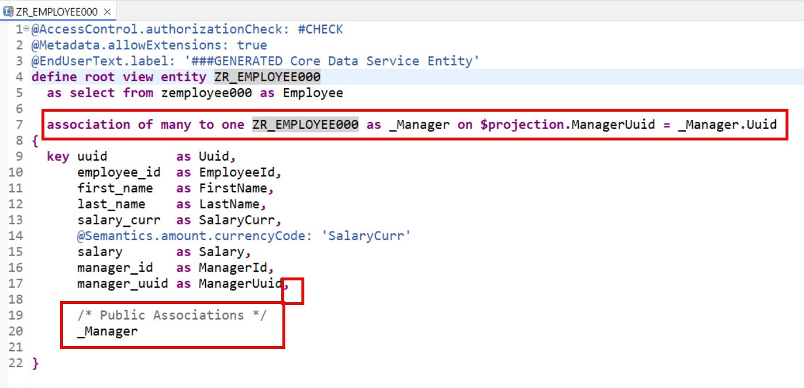
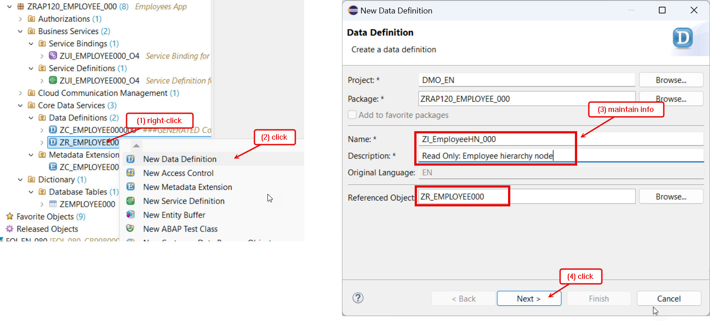
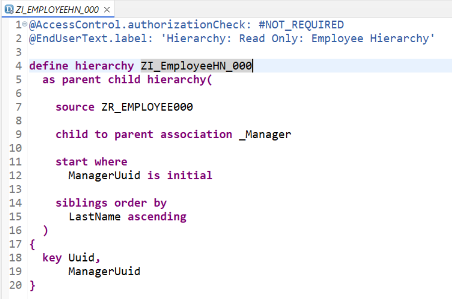
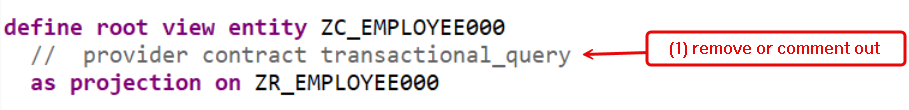
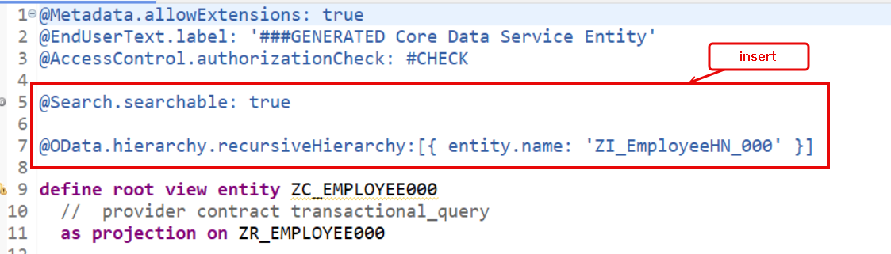
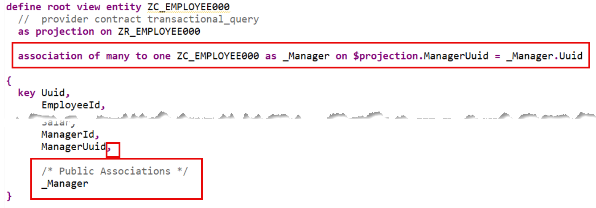
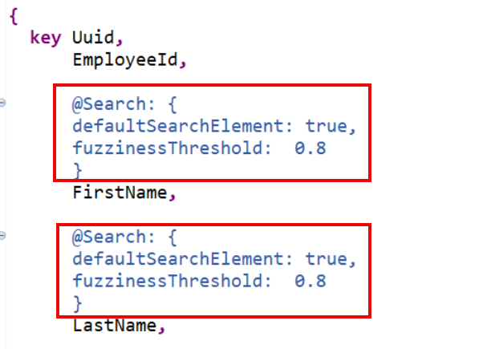
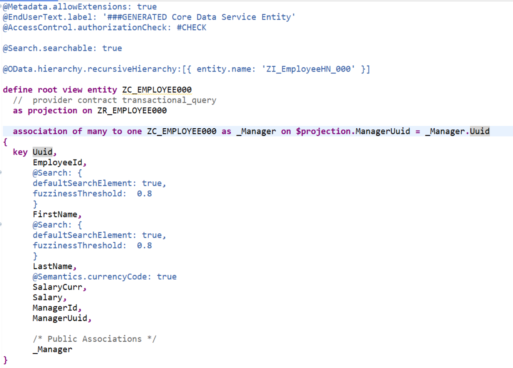
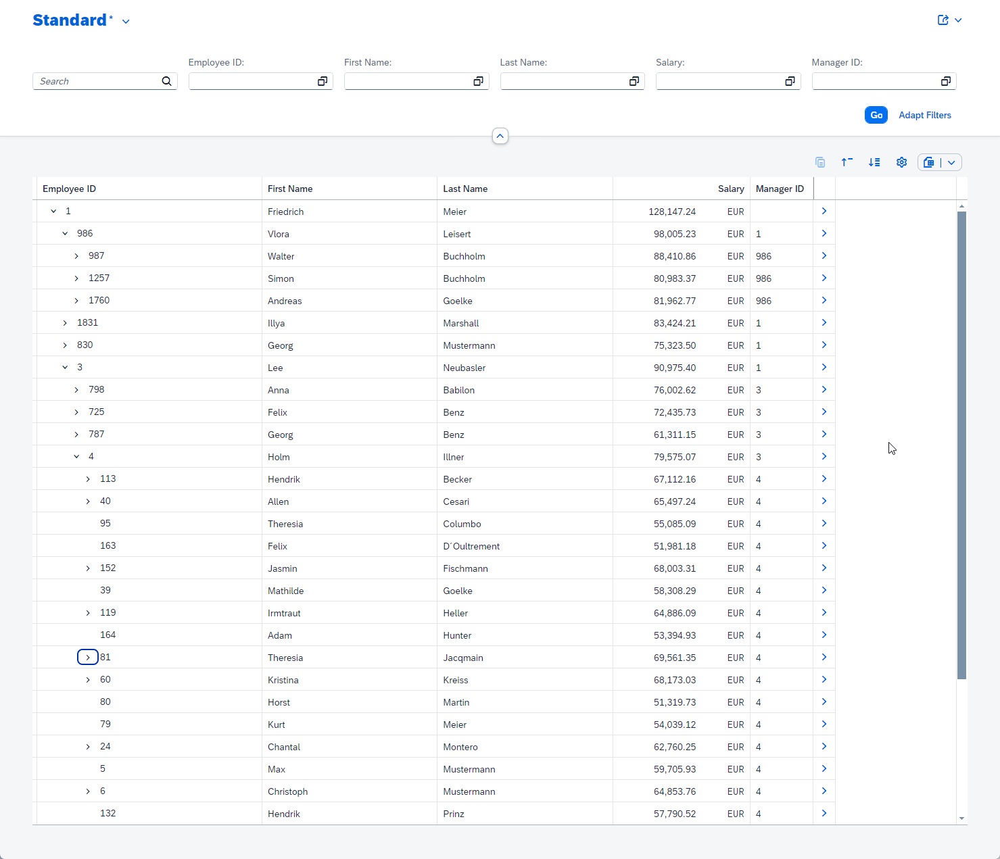

[Home - RAP120](/README.md#exercises)

# Exercise 5: Implement the read-only Treeview for Hierachical Data Display

## Introduction

> In the previous exercise, you've generated a read-only UI service to display employee data with the AI-based ADT wizard (_Beta_) (see [Exercise 4](../ex04/README.md)). 
> 
> In this exercise, you will first enhance the generated interface view (`ZR_`). You will add a self-association to the parent node of that same CDS view to add the hierarchical logic to the exisiting data, indicating that an employee UUID (an ID) can also serve as the manager UUID (an ID) for another employee.    
> You will then create a CDS hierarchy view to define how the hierarchical data is interpreted with a parent-child hierarchy.   
> You will then enhance the generated consumption view (`ZC_`) to connect the exposed data from the interface view (`ZR_`) with the hierarchical interpretation of the data from the hierarchy entity. Finally, you will preview the enhanced _Emplosee_ app
>  

> ℹ️ **Note**: 
> According to the [naming conventions of the Virtual Data Model (VDM) in SAP S/4HANA](https://help.sap.com/docs/SAP_S4HANA_CLOUD/c0c54048d35849128be8e872df5bea6d/8a8cee943ef944fe8936f4cc60ba9bc1.html), interface views have the prefix **`<namespace>I_`** and basic/composite restricted reuse views and BO views have the prefix **`<namespace>R_`**. The current wizard of the AI-based generator doesn't yet allow you to changes the generated artifact names. This option will be added in the future.  
> 
> For this reason, the generated interface view has the suffix `ZR_` instead of `ZI_` in this exercises.

### Exercise Steps:
- [Exercise 5.1 - Enhance to the Generated Interface View](#exercise-51-enhance-the-generated-interface-view)
- [Exercise 5.2 - Define the Hierarchy Interpretation](#exercise-52-define-the-hierarchy-interpretation)
- [Exercise 5.3 - Enhance to the Generated Consumption View](#exercise-53-enhance-the-generated-consumption-view)
- [Exercise 5.4 - Display the Treeview on the SAP Fiori UI](#exercise-54-display-the-treeview-on-the-sap-fiori-ui) 
- [Summary & Next Exercise](#summary--next-exercise)  


## Exercise 5.1: Enhance the Generated Interface view
[^Top of page](#)
   
  > Enhance the interface view **`ZR_EMPLOYEE###`** by defining and exposing a self-association to the parent node of that same CDS view.   
  > This adds the hierarchical logic to the exisiting data, indicating that an employee ID can also serve as the manager ID for another employee. Since one manager can have several employees, the cardinality is defined as many to one.


 <details>
  <summary>🔵 Click to expand!</summary>

   1. Go to your package in the **Project Explorer**, open the CDS data definition **`ZR_EMPLOYEE###`** and add the code snippet below to define the self-association as shown on the screenshot below. Replace the placeholder `###` with your suffix.
   
      ```
      association of many to one ZR_Employee### as _Manager on $projection.ManagerUuid = _Manager.Uuid
      ```       
      
   2. Add the self-association to the _select_ list to make it public. Use the code snippet provided below.
   
      ```
      ,   
   
      /* Public Associations */
      _Manager
      ```       
   
      

   3. Save  and activate  the changes.
          
</details>


## Exercise 5.2: Define the Hierarchy Interpretation
[^Top of page](#)
   
  > You will now create a CDS hierarchy entity **`ZI_EmployeeHN_###`** where you will define how the hierarchical data is interpreted with a parent-child hierarchy.
  > 
  > The _employee_ node has a uuid-based primary key (`Uuid`) in this exercise. The element (`EmployeeId`) contains a semantic key for _employee_ entities.
 
 <details>
  <summary>🔵 Click to expand!</summary>

   1. Go to your package in the **Project Explorer**, navigate to the folder **Core Data Services > Data Definition**, right-click on it and select **???** from the context menu. 
      
      Maintain the required information provided below, select a transport request if necessary, and click **Finish** to confirm the creation.    
      - Name: **`ZI_EmployeeHN_###`**
      - Description: **`Read Only: Employee hierarchy node`**   
      - Referenced Object: **`ZR_Employee###`**
   
      <br/>
      
 
   2. Delete the default data definition in the editor and replace it with the source code provided below. 
   
      Remember to replace all occurences of the placeholder **`###`** with your suffix.
   
      >  ℹ️ **Note**: Do not forget that the generated artefact and field names may differ from the ones use in the provided code snippets.   
      >              Therefore, always make sure to adjust them if necessary.
  
      ```ABAP
      @AccessControl.authorizationCheck: #NOT_REQUIRED
      @EndUserText.label: 'Hierarchy: Read Only: Employee Hierarchy'

      define hierarchy ZI_EmployeeHN_###
        as parent child hierarchy(   
          source ZR_Employee###   
          child to parent association _Manager      
          start where
            ManagerUuid is initial      
          siblings order by
            LastName ascending
        )
      {
        key Uuid,
            ManagerUuid
      }
      ```       
   
      > ℹ️ **Brief code explanation:** 
   
      <details>
        <summary>Click to expand!</summary>   
         
         > - The hierarchical data is interpreted with a parent-child hierarchy using the statement **`as parent child hierarchy`**.  
         > - The interface view **`ZR_Employee###`** is specified as the data source using the keyword **`source`**.  
         > - The hierarchy typically starts where there is no manager above, which is the CEO. Therefore, the root node of the hierarchy is where the manager UUID (and ID) is zero, i.e. initial. The starting condition is specified with the statement **`start where ... is initial`**.   
         > - In this example, siblings are employees who report to the same manager. They are sorted by their last names. The sorting order is specified using the statement **`siblings order by`**.   
         > - The employee primary key **`Uuid`** and the manager primary key **`managerUuid`** are specified in the _select_ list.      

      </details>   
   
      <br/>
            
        
   3. Save  and activate  both database tables.
             
</details>


## Exercise 5.3: Enhance the Generated Consumption View
[^Top of page](#)
   
 >  You will now enhance the consumption view **`ZC_Employee###`** by removing the specify provider contract for transactional apps, adding a self-association to the parent node of that same CDS view, and connecting it with the hierarchical interpretation of the data from the hierarchy entity.
 >  
 >  You will also define the view as searchable and add some semantics to the some of the elements in the _select_ list.

<details>
  <summary>🔵 Click to expand!</summary>

   1. Go to your package in the **Project Explorer**, open the CDS data definition **`ZC_EMPLOYEE###`**, and start by removing the specified provider contract **`provider contract transactional_query`** because this is a **read-only** treeview. 
   
        
      
   2. Now connect the consumption view with the hierarchical interpretation of the data defined in the hierarchy entity **`ZR_EMPLOYEEHN_###`** by sepcifying the following view annotation provided and replacing **`###`** with your suffix.

      ```
      @OData.hierarchy.recursiveHierarchy:[{ entity.name: 'ZI_EmployeeHN_###' }] 
      ```       
   
      Also specify the projection view as searchable by adding the following view annotation as shown on the screenshot below:
   
      ```
      @Search.searchable: true
      ```          
   
      
   
   2. Define the self-association by adding the code snippet to the data definition as shown on the screenshot below.
   
      ```
      association of many to one ZC_Employee### as _Manager on $projection.ManagerUuid = _Manager.Uuid
      ```       
   
   
      And add the self-association to the _select_ list to make it public. Use the code snippet provided below.
   
      ```
      ,  

      /* Public Associations */
      _Manager
      ```      

         
   
   4. Enable the full-text search with a specific error tolerance (fuzziness threshold) for the elements **`FirstName`** and **`LastName`** by specifying the following annotation block directly before each field:          
   
         ```
         @Search: {
           defaultSearchElement: true,
           fuzzinessThreshold:  0.8
         }
         ```        
   
      <br/>   
         
   
   5. Save  and activate  the changes.
   
      The enhanced consumption view looks as follows:
   
      <br/>   
            
   
          
</details>


## Exercise 5.4: Display the Treeview on the SAP Fiori UI
 
> Preview the enhanced _Employee_ app in the browser to visualize the hierchical data as treeview. 

 <details>
  <summary>🔵 Click to expand!</summary>

   1. Open your service binding **`ZUI_EMPLOYEE###_O4`**, select the entity set **Employee**, and click **Preview** to start the Fiori Elements App Preview in the browser.
   
      The _employee_ data is now displayed in a hierarchical tree view. 
 
      
     
   2. Now you can navigate through the hierarchical _employee__ data in the treeview
   
</details>


## Summary 
[^Top of page](#)

Now that you've... 
- defined and exposed the self-association adjusted the interface view, 
- defined the hierarchy interpretation, i.e. how the hierarchical data is interpreted with a parent-child hierarchy in a CDS hierarchy view, 
- defined and exposed the self-association adjusted the consumption view, and 
- connected the consumption view with the hierarchical interpretation of the data from the hierarchy entity,

you are done with this exercise group (B). Congratulations! 🎉

In this hands-on exercise group, you have hopefully have some more insights into new ABAP Cloud capabilities such as the GenAI generation of OData-based UI services and tree-views! Note that SAP plans to support editable treeviews in the future. Learn more in the [ABAP Cloud Roadmap Information](https://help.sap.com/docs/abap-cross-product/roadmap-info/ui-services).

You can now return to ► **[Home - RAP120](/README.md#exercises)**.

## License

Copyright (c) 2024 SAP SE or an SAP affiliate company. All rights reserved. This project is licensed under the Apache Software License, version 2.0 except as noted otherwise in the [LICENSE](LICENSES/Apache-2.0.txt) file.
