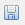

[Home - RAP120](/README.md#exercises)

# ⚠️ THIS PAGE WILL BE DELETED SOON ⚠️- Exercise 6: Define the Hierarchy Interpretation

🚧🚧🚧🚧

## Introduction

> In the previous exercise, you've enhanced the interface view to define and expose a self-association to it. (see [Exercise 5](../ex05/README.md)). 
> 
> In this exercise, you will define how the hierarchical data is interpreted with a parent-child hierarchy in a CDS hierarchy view.
> 

### Exercise Steps:
- [Exercise 6.1 - Define the Hierarchy Interpretation](#step-61-define-the-hierarchy-interpretation)
- [Summary & Next Exercise](#summary--next-exercise)  


## Exercise 6.1: Define the Hierarchy Interpretation 
[^Top of page](#)
   
  > In this view, you need to define and expose a self-association to the parent node of that same CDS view **`ZI_EmployeeHN_###`**. 
  > 
  > 🚧🚧🚧 or **`ZR_EmployeeHN_###`**???
  > See here https://help.sap.com/docs/abap-cloud/abap-rap/creating-hierarchy-node?version=s4hana_cloud
 
 <details>
  <summary>🔵 Click to expand!</summary>

   1. Go to your package in the **Project Explorer**, navigate to the folder **Core Data Services > Data Definition** right-click on it and select **???** from the context menu.
      
      Maintain the required information provided below, select a transport request if required and click **Finish** to confirm the creation.    
      🚧🚧
      - Name: ...
      - ???: ...
  
 
   2. Delete the default source code will be displyed in editor and replace it with the source code provided below. 
   
      Do not forget to replace all occurences of the placeholder **`###`** with your chosen suffix.
  
      ```ABAP
         @AccessControl.authorizationCheck: #NOT_REQUIRED
         @EndUserText.label: 'Hierarchy: Read Only: Employee Hierarchy'

         define hierarchy ZI_EmployeeHN_###
           as parent child hierarchy(
             source ZI_Employee_###
             child to parent association _Manager
             start where
               Manager is initial
             siblings order by
               LastName ascending
           )
         {
           key EmployeeUuid,
               ManagerUuid,
               Employee,
               Manager
         }
      ```       
   
      
   
   
      ℹ️ **Short Explanation**: 
       
      <details>
        <summary>Click to expand!</summary>
           
           Define how the hierarchical data is interpreted with a parent-child hierarchy in the artifact `ZR_EmployeeHN_###`:         
           ```ABAP
              define hierarchy ZR_EmployeeHN_### as parent child hierarchy
           ```     

            Define how the hierarchical data is interpreted with a parent-child hierarchy in the artifact `ZR_EmployeeHN_###`:
            ```ABAP
             define hierarchy ZR_EmployeeHN_### as parent child hierarchy
            ```     

            Refer to the hierarchical data /DMO/I_Employee_HR as a source:
            ```ABAP
                source ZR_Employee_### child to parent association _Manager
            ```               

            The hierarchy typically starts where there is no manager above, which is the CEO. Therefore, the root node of the hierarchy is where the manager ID is zero (initial).
            ```ABAP
              start where Manager is initial
            ```                         
            In this example, siblings are employees who report to the same manager. You can sort siblings by their last name, for example:
            ```ABAP
            siblings order by LastName ascending
            ```          

            [Learn more](https://help.sap.com/docs/abap-cloud/abap-rap/creating-hierarchy-node?version=s4hana_cloud)          
      </details>

        
   3. Save  and activate  both database tables.
             
</details>


## Summary & Next Exercise
[^Top of page](#)

Now that you've... 
- defined the hierarchy interpretation, i.e. how the hierarchical data is interpreted with a parent-child hierarchy in a CDS hierarchy view 

you can continue with the next exercise - **[Exercise 7: Adjust the Generated Consumption View & Display the Treeview](../ex07/README.md)**.


## License

Copyright (c) 2024 SAP SE or an SAP affiliate company. All rights reserved. This project is licensed under the Apache Software License, version 2.0 except as noted otherwise in the [LICENSE](LICENSES/Apache-2.0.txt) file.
