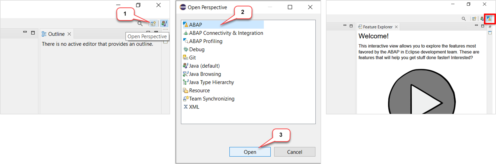
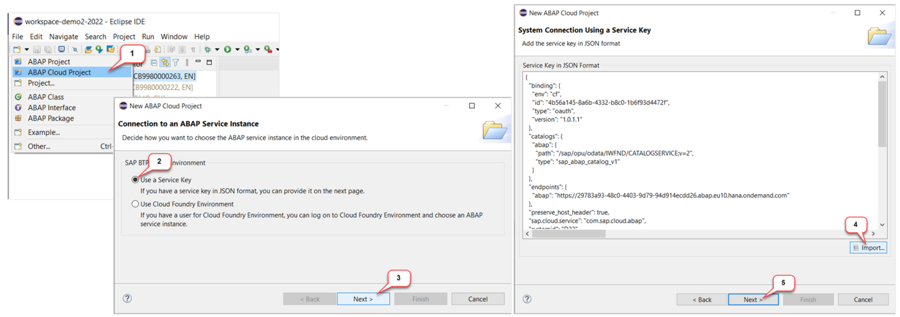
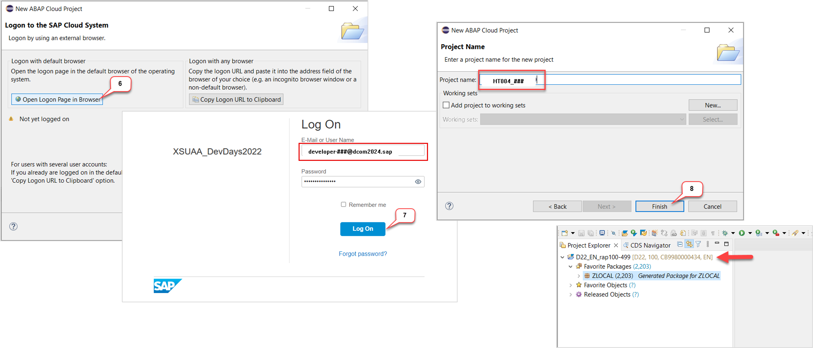

## ABAP User Credentials

Use the following **ABAP user credentials** when prompted in ADT or in the browser:
- Email: `developer-###@dcom2024.sap`, where `###` is your group ID assigned by the instructors    
- Password: `Welcome1!`  

## ADT Service Key for AI1

> Check the service key to the *SAP BTP ABAP Environment* system **AI1**

<details>
<summary>🔵Click to expand!</summary>

```
{
  "binding": {
    "env": "cf",
    "id": "2b39a736-f4c7-4f38-a35f-d50aa4d0f8a7",
    "type": "oauth",
    "version": "1.0.1.1"
  },
  "catalogs": {
    "abap": {
      "path": "/sap/opu/odata/IWFND/CATALOGSERVICE;v=2",
      "type": "sap_abap_catalog_v1"
    }
  },
  "endpoints": {
    "abap": "https://62135803-626f-4a74-9316-74e24db7f7b6.abap.eu10.hana.ondemand.com"
  },
  "preserve_host_header": true,
  "sap.cloud.service": "com.sap.cloud.abap",
  "systemid": "AI1",
  "uaa": {
    "apiurl": "https://api.authentication.eu10.hana.ondemand.com",
    "clientid": "sb-xs-62135803-626f-4a74-9316-74e24db7f7b6!b390836|xsuaa-abapcp-prod-eu10!b4584",
    "clientsecret": "2b39a736-f4c7-4f38-a35f-d50aa4d0f8a7$_N43wakrq8wmZAZ9TcVLbOMEF_y2owGRv6MZL3FDFqw=",
    "credential-type": "binding-secret",
    "identityzone": "techxchange-te4",
    "identityzoneid": "71301999-65fd-4922-a4ba-84211c75c526",
    "sburl": "https://internal-xsuaa.authentication.eu10.hana.ondemand.com",
    "serviceInstanceId": "62135803-626f-4a74-9316-74e24db7f7b6",
    "subaccountid": "71301999-65fd-4922-a4ba-84211c75c526",
    "tenantid": "71301999-65fd-4922-a4ba-84211c75c526",
    "tenantmode": "dedicated",
    "uaadomain": "authentication.eu10.hana.ondemand.com",
    "url": "https://techxchange-te4.authentication.eu10.hana.ondemand.com",
    "verificationkey": "-----BEGIN PUBLIC KEY-----\nMIIBIjANBgkqhkiG9w0BAQEFAAOCAQ8AMIIBCgKCAQEAn1D1OsCMZNKTrlLns1QW\njAtKJO/bsHoWqCI2fQ7QWPSYgQj2jqO34y4FvdlTZ29uVWJX7S4ITZl4+9FRBCGd\nHpaZgCjN09J5flsZX07AV1WxS15HJPvO5/L1GaAVx2bQFOYi+lP7Sqma3tplzXP5\nOvE3DFBm4Wn6wkBKfASHjAa2Z2/D1dskwJtb5Yct+Z9u/ElaT25wzYqXfXhkhrzx\n9ID2wQK7r4c0eYgnNVrzQg4YMt8xIGRXdYt8X9r5vbx8wxRrtdw81uQWeSTr20/n\nUaVTbzr/inMGq20q7DtaXzdJbk1SXpufvfsdz0FFZtDV2RudGR6Y8VkTaJxu3+Jl\nQQIDAQAB\n-----END PUBLIC KEY-----",
    "xsappname": "xs-62135803-626f-4a74-9316-74e24db7f7b6!b390836|xsuaa-abapcp-prod-eu10!b4584",
    "zoneid": "71301999-65fd-4922-a4ba-84211c75c526"
  },
  "url": "https://62135803-626f-4a74-9316-74e24db7f7b6.abap.eu10.hana.ondemand.com"
}
```
  
</details>

<!--

## ADT Service Key for AI2

> Check the service key to the *SAP BTP ABAP Environment* system **AI2**

<details>
<summary>🔵Click to expand!</summary>
  
```
{
  "binding": {
    "env": "cf",
    "id": "65125c8c-dab7-4ea9-8b35-4e48d13542fd",
    "type": "oauth",
    "version": "1.0.1.1"
  },
  "catalogs": {
    "abap": {
      "path": "/sap/opu/odata/IWFND/CATALOGSERVICE;v=2",
      "type": "sap_abap_catalog_v1"
    }
  },
  "endpoints": {
    "abap": "https://30b5f545-9e0c-4d62-990d-5460584e3d0d.abap.eu10.hana.ondemand.com"
  },
  "preserve_host_header": true,
  "sap.cloud.service": "com.sap.cloud.abap",
  "systemid": "AI2",
  "uaa": {
    "apiurl": "https://api.authentication.eu10.hana.ondemand.com",
    "clientid": "sb-xs-30b5f545-9e0c-4d62-990d-5460584e3d0d!b390836|xsuaa-abapcp-prod-eu10!b4584",
    "clientsecret": "65125c8c-dab7-4ea9-8b35-4e48d13542fd$j8-U68wsOy3-oqO4pTVJBFzk0t5bfYMewyjDRVke1J8=",
    "credential-type": "binding-secret",
    "identityzone": "techxchange-te4",
    "identityzoneid": "71301999-65fd-4922-a4ba-84211c75c526",
    "sburl": "https://internal-xsuaa.authentication.eu10.hana.ondemand.com",
    "serviceInstanceId": "30b5f545-9e0c-4d62-990d-5460584e3d0d",
    "subaccountid": "71301999-65fd-4922-a4ba-84211c75c526",
    "tenantid": "71301999-65fd-4922-a4ba-84211c75c526",
    "tenantmode": "dedicated",
    "uaadomain": "authentication.eu10.hana.ondemand.com",
    "url": "https://techxchange-te4.authentication.eu10.hana.ondemand.com",
    "verificationkey": "-----BEGIN PUBLIC KEY-----\nMIIBIjANBgkqhkiG9w0BAQEFAAOCAQ8AMIIBCgKCAQEAn1D1OsCMZNKTrlLns1QW\njAtKJO/bsHoWqCI2fQ7QWPSYgQj2jqO34y4FvdlTZ29uVWJX7S4ITZl4+9FRBCGd\nHpaZgCjN09J5flsZX07AV1WxS15HJPvO5/L1GaAVx2bQFOYi+lP7Sqma3tplzXP5\nOvE3DFBm4Wn6wkBKfASHjAa2Z2/D1dskwJtb5Yct+Z9u/ElaT25wzYqXfXhkhrzx\n9ID2wQK7r4c0eYgnNVrzQg4YMt8xIGRXdYt8X9r5vbx8wxRrtdw81uQWeSTr20/n\nUaVTbzr/inMGq20q7DtaXzdJbk1SXpufvfsdz0FFZtDV2RudGR6Y8VkTaJxu3+Jl\nQQIDAQAB\n-----END PUBLIC KEY-----",
    "xsappname": "xs-30b5f545-9e0c-4d62-990d-5460584e3d0d!b390836|xsuaa-abapcp-prod-eu10!b4584",
    "zoneid": "71301999-65fd-4922-a4ba-84211c75c526"
  },
  "url": "https://30b5f545-9e0c-4d62-990d-5460584e3d0d.abap.eu10.hana.ondemand.com"
}
```
  
</details>

-->

<!--

## Create an _ABAP Cloud Project_ or _ABAP Project_ in ADT
[^Top of page](#)

> Create an _**ABAP Cloud Project**_ in your ADT installation to connect it to the **SAP BTP ABAP Environment** system.

<details>
  <summary>🔵Click to expand!</summary>
   
1. Open the **ABAP** perspective if not yet done.

    

2. Now create the **ABAP Cloud Project** as shown on the screenshots provided below. 
  
    > PS: Use the user credentials provided at the top of this page

    

    

</details>

-->

## License

Copyright (c) 2024 SAP SE or an SAP affiliate company. All rights reserved. This project is licensed under the Apache Software License, version 2.0 except as noted otherwise in the [LICENSE](LICENSES/Apache-2.0.txt) file.
